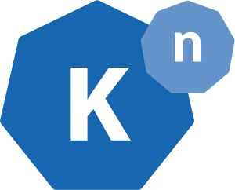

# Knative Hands-on Workshop

## What is Knative? 

The [Knative web site](https://knative.dev) describes it as “components build on top of Kubernetes, abstracting away the complex details and enabling developers to focus on what matters.” 

It has two distinct components, originally it were three. The third was called Knative Build, it is now a project of its own: [Tekton](https://tekton.dev/). 

* __Knative Serving__ is responsible for deploying and running containers, also networking and auto-scaling. Auto-scaling allows scale to zero and is the main reason why Knative is referred to as Serverless platform.
* __Knative Eventing__ allows to connect Knative services (deployed by Knative Serving) or other Kubernetes deployments with events or streams of events.

This workshop will **focus on Knative Serving** and will cover the following topics:

1. Prerequisites (access to a Kubernetes cluster, work environment, etc.)
1. Installing Knative
1. Deploying an example app as Knative Service
1. Creating a Knative Revision
1. Traffic Management
1. Auto-Scaling
1. Debugging Tips

There are two distinct workshop tracks. Your workshop instructor will tell you which one to follow.

Track 1: Kubernetes   | Track 2: Openshift
--------- | -----------
**[Knative on IBM Cloud Kubernetes Service (IKS)](iks/1-Prereqs.md)** | **[OpenShift Serverless on Red Hat OpenShift on IBM Cloud](openshift/1-Prereqs.md)** 

To complete this workshop, basic understanding of Kubernetes/OpenShift and application deployment on Kubernetes is instrumental!

## Resources:

You can find detailed information and learn more about Knative here:

1. [Knative documentation](https://knative.dev/docs)
2. [Red Hat Knative Tutorial](https://redhat-developer-demos.github.io/knative-tutorial/knative-tutorial/index.html)
3. [Deploying serverless apps with Knative (IBM Cloud Documentation)](https://cloud.ibm.com/docs/containers?topic=containers-serverless-apps-knative)

There is an [Instructor Readme](instructor.md), too.

## Tools:

In this workshop we will be using the IBM Cloud Shell which has all required tools installed.

Should you prefer to run the workshop completely off your own workstation you need the following tools (depending on the track you select):

Tool  |Source       
----------------|----
git CLI|https://git-scm.com/downloads 
ibmcloud CLI|https://cloud.ibm.com/docs/cli?opic=cli-install-ibmcloud-cli
ibmcloud plugin|https://cloud.ibm.com/docs/cli?topic=cli-plug-ins -- Install kubernetes-service plugin
oc|Download from OpenShift Web Console, click on question mark
kn|https://knative.dev/docs/install/install-kn/
hey|HTTP Load generator: https://github.com/rakyll/hey

