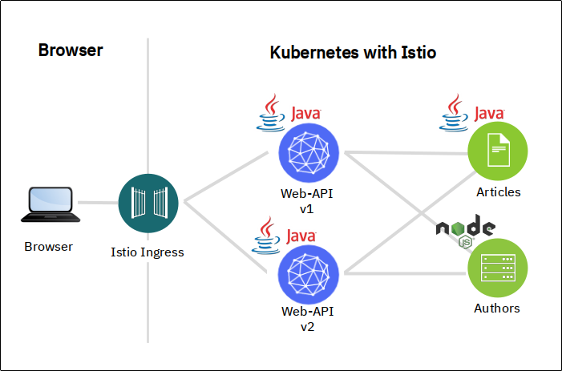

# Knative: Deploying a Microservices Application

There are already plenty of things to do and learn in this workshop and probably not enough time.

If you have time and interest you could try a more realistic example for Knative Serving, based on our [Cloud Native Starter](https://github.com/IBM/cloud-native-starter) project. 

Instructions on how to use this sample are posted [here](https://haralduebele.blog/2020/07/02/knative-example-deploying-a-microservices-application/).

The base YAML files for the Knative services are in this directory. The container images of the microservices are on Docker Hub.