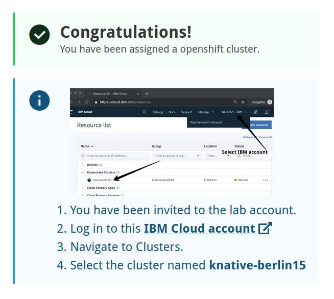

# Prerequisites

## 1. Create an IBM Cloud Account

We will use pre-provisioned Kubernetes clusters on the IBM Cloud for this workshop. You need an IBM Cloud Account to assign yourself one of these clusters:

1. You can register at [https://cloud.ibm.com](https://cloud.ibm.com).

    We need your email address, a password, your name, and your country. 
    
    During the registration, we will send a verification code to your email address that you have to enter into the registration form. 
    
    Registration is free and without any obligations.

1. Logon to the IBM Cloud Dashboard [https://cloud.ibm.com](https://cloud.ibm.com).

## 2. Assign yourself a pre-provisoned cluster

In this step you will assign yourself a pre-provisioned cluster. 

1. Your lab instructor will provide a link to an application and a "lab key". Open the application in your browser:
   
   
2. Enter the lab key provided and your IBMid (it is the email address you used to register at the IBM Cloud), agree to the T&Cs, and click "Submit":
   
   
   Of course your cluster will be named differently and the lab account you need to select from the pull-down in the IBM Cloud Dashboard is **1840867 - Advowork**.
   
## 3. Work Environment

To see details about your assigned cluster and access the Kubernetes dashboard follow these steps:

1. Go back to the IBM Cloud Dashboard (step 1)
1. In the title bar, open the Accounts pull-down menu (you may need to refresh your browser) and select the lab account **1840867 - Advowork**:
     
1. Select __Kubernetes -> Clusters__ from the burger menu:
   
1. This will display your list of available cluster with one entry:
   
1. Click on the entry, this displays all the details about your cluster:
   
1. You can access the Kubernetes dashboard with the blue button.     

We will work with the cluster in the command line mostly, using different CLIs. IBM Cloud Shell is a web based shell (terminal) that has all the required tools available. 

1. Access IBM Cloud Shell using the icon in the title bar. Make sure you are in the IBM account (1840867 - Advowork)!:  
   
1. It will take a moment to set up a session. Cloud Shell offers 500 MB of temporary storage, the session will close after 1 hour of inactivity, workspace data will be removed then.
1. Enter the command:
   ```
   ibmcloud ks cluster ls
   ```
   This should display the name of your cluster, its ID, and a few other things
1. Create an environment variable $CLUSTER_NAME that contains the name of your cluster.
  
   Example:
   ```
   export CLUSTER_NAME=mycluster-ams03-b3c.4x16
   ```  
1. Download the cluster configuration for 'kubectl':
   ```
   ibmcloud ks cluster config --cluster $CLUSTER_NAME
   ```
      
1. Test access to the cluster by displaying the available namespaces:
   ```
   kubectl get namespace
   ```

## 4. Get the code

In your Cloud Shell enter the following command to download the code from Github:

```
git clone https://github.com/Harald-U/knative-handson-workshop.git
cd knative-handson-workshop/code
```

---

__Continue with the next part [Installing Knative](2-InstallKnative.md)__
      