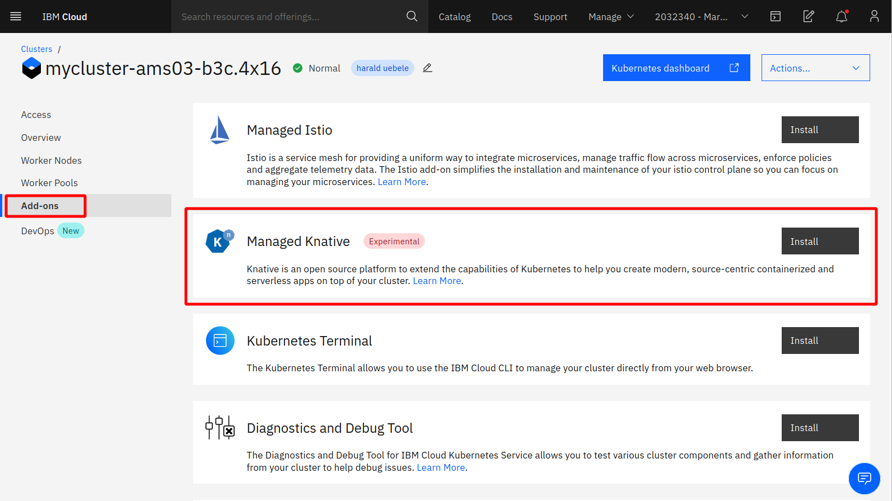
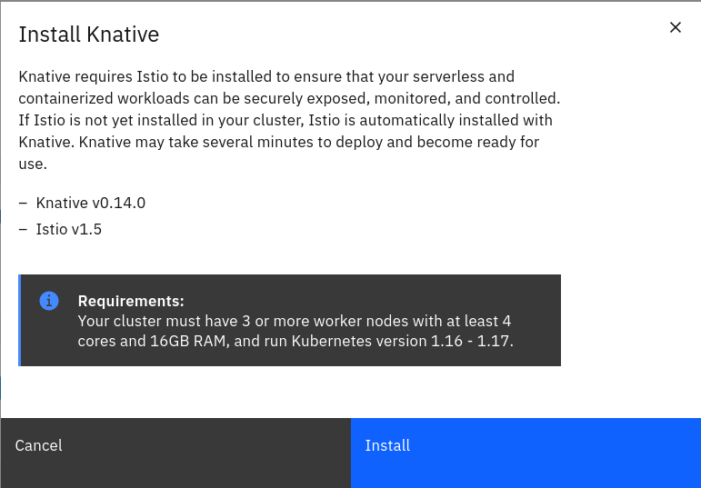
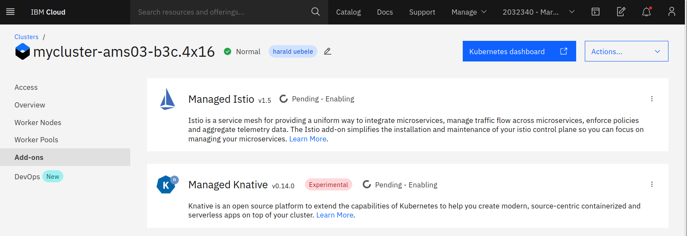

# Installing Knative

Knative [requires a networking layer with an Ingress](https://knative.dev/docs/install/any-kubernetes-cluster/) that is not part of the Knative installation itself. There are several options, Istio is one of them, another one is [Kourier](https://github.com/knative/net-kourier) which is actually maintained now by the Knative project. Others are Ambassador, Contour, Glue, and Kong. Red Hat OpenShift Serverless, the OpenShift version of Knative, uses Kourier. We will use Istio in this lab, it is already available on the IBM Cloud.

The Kubernetes cluster that has been assigned to you and that you will use during this workshop is provided by the [IBM Cloud Kubernetes Service](https://cloud.ibm.com/docs/containers?topic=containers-getting-started), IKS. 

IKS offers add-ons to Kubernetes, namely Istio and Knative. They will be automatically installed and managed by IBM. There is a cluster size requirement for Istio (minimum 3 worker nodes) which is also applicable to Knative because it requires Istio. The pre-provisioned clusters meet the requirement. Installing the Knative add-on automatically installs Istio if required. 

1. To install Knative, go to the 'Add-ons' page of your cluster:
   
   
1. Click on 'Install', this will inform you about the version of Istio and Knative:
   
   
1. Click 'Install' again, after a moment, the 'Install' buttons for Istio and Knative will disappear and a status for the installation will show:
   
      
1. The installation status will show a green check mark and "Normal - Addon Ready"
when Knative and Istio have been installed successfully.

1. In the IBM Cloud Shell check the Kubernetes namespaces:

   ```
   kubectl get ns
   ```
   Output:
   ```
   NAME               STATUS   AGE
   default            Active   18h
   ibm-cert-store     Active   18h
   ibm-operators      Active   18h
   ibm-system         Active   18h
   istio-system       Active   12m
   knative-eventing   Active   12m
   knative-serving    Active   12m
   knative-sources    Active   12m
   kube-node-lease    Active   18h
   kube-public        Active   18h
   kube-system        Active   18h
   tekton-pipelines   Active   12m
   ```
   
   Notice 'istio-system' and the namespaces starting with 'knative-'
   
   If you like check the pods in each of these namespaces.
   
---

__Continue with the next part [Deploy a Knative Service](3-DeployKnativeService.md)__      

