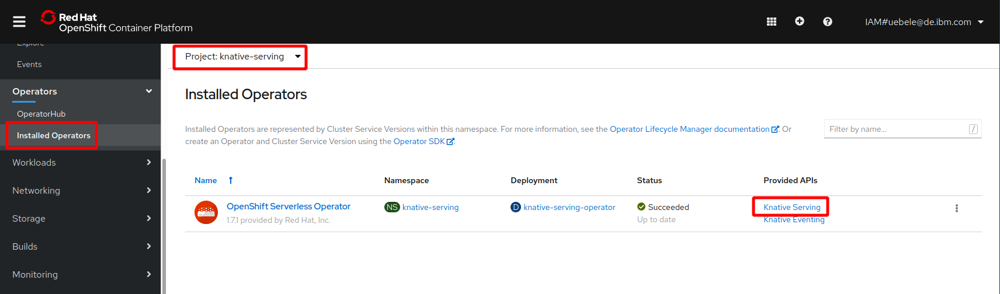
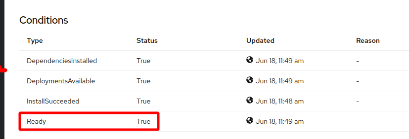

# Installing OpenShift Serverless aka Knative

The OpenShift version of Knative is called [OpenShift Serverless](https://access.redhat.com/documentation/en-us/openshift_container_platform/4.3/html/serverless_applications/serverless-getting-started). It is installed and managed with an Operator.

1. Go back to the OpenShift Web Console.

1. In the 'Adminstrator' view, select 'Operators -> OperatorHub' and search for 'serverless':
   

1. Click on 'OpenShift Serverless Operator', then click on the blue 'Install' button. In the 'Create Operator Subscription' dialog keep the defaults, and click 'Subscribe':
   

1. The Console now displays the 'Installed Operators'. Change to the 'openshift-operators' project and wait until the status shows 'Succeeded / Up to date':
     

1. Next we create a namespace for Knative Serving. The Red Hat instructions specifically ask to create a namespace, not a project.
   Go to 'Administrator: Administration -> Namespaces', click 'Create Namespace' and enter 'knative-serving' as name:
   
   Click 'Create'.

1. Go back to 'Installed Operators', make sure the 'knative-serving' project is selected, and click on 'Knative Serving' API:
   

1. Click the blue 'Create Knative Serving' button, check the YAML, and click 'Create':
     

1. In the 'Operator Details' view for the Serverless operator, you can now see the Knative Serving instance created. But it seems to stay in Status 'Unknown':
   

1. Click on the Name 'knative-serving', on in the 'Overview' scroll down to Conditions. You can see all 4 conditions are true, including 'Ready':
   
   In the 'Resources' tab you will see many deployments, services, pods, all should be 'Created' or 'Running'.

We will not look into Knative Eventing in this workshop.

---

__Continue with the next part [Deploy a Knative Service](3-DeployKnativeService.md)__      

