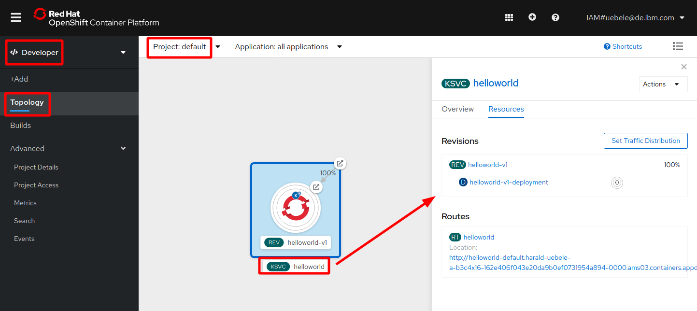

# Deploy a Knative Service


Knative Serving is responsible for deploying and running containers and also for networking and auto-scaling. Auto-scaling in Knative allows scale to zero and is probably the main reason why Knative is referred to as Serverless platform.

This is some text from the [Knative Runtime Contract](https://github.com/knative/serving/blob/master/docs/runtime-contract.md) which helps to position Knative. It compares Kubernetes workloads (general-purpose containers) with Knative workloads (stateless request-triggered autoscaled containers):

> In contrast to general-purpose containers, stateless request-triggered (i.e. on-demand) autoscaled containers have the following properties:
> * Little or no long-term runtime state (especially in cases where code might be scaled to zero in the absence of request traffic).
> * Logging and monitoring aggregation (telemetry) is important for understanding and debugging the system, as containers might be created or deleted at any time in response to autoscaling.
> * Multitenancy is highly desirable to allow cost sharing for bursty applications on relatively stable underlying hardware resources.

In other words: Knative positions itself suited for short running, stateless processes. You need to provide central logging and monitoring because the pods come and go. And multi-tenant hardware is best because it can be provided large enough to scale for peaks and at the same time make effective use of the resources. 

Knative uses new terminology for its resources and unfortunately there is some duplication of Kubernetes terms:

1. __Service:__ Responsible for managing the life cycle of an application/workload. Creates and owns the other Knative objects Route and Configuration.
1. __Route:__ Maps a network endpoint to one or multiple Revisions. Allows Traffic Management. 
1. __Configuration:__ Desired state of the workload. Creates and maintains Revisions.
1. __Revision:__ A specific version of a code deployment. Revisions are immutable. Revisions can be scaled up and down. Rules can be applied to the Route to direct traffic to specific Revisions.


And Knative uses a new CLI `kn` which is already installed in IBM Cloud Shell.

## Sample application

In this workshop we will use one of the [Hello World](https://knative.dev/docs/serving/samples/hello-world/) code samples from the Knative documentation site.

I have taken the liberty to copy the Node.js sample code into this Github repository so that everything is in one place. 

This is the application code:

```
const express = require('express');
const app = express();

app.get('/', (req, res) => {
  console.log('Hello world received a request.');

  const name = process.env.TARGET || 'World';
  res.send(`Hello ${name}!`);
});

const port = process.env.PORT || 8080;

app.listen(port, () => {
  console.log('Hello world listening on port', port);
});
```

When you make a GET request to the applications root URI ('/') it will respond with 'Hello' plus the content of the environment variable 'TARGET', or with 'World' if TARGET is not set. In addition it will log each request (console.log) which we can later pick up with 'kubectl logs ...'

This allows to simply create new versions for deployments = Knative Revisions by just changing the content of TARGET. Not very sophisticated but sufficient to show the principles of Knative.

There is also a Dockerfile that can be used to build a container image. You can use it to create your own version and store it in your own Container Image Repository or build it on OpenShift directly using a binary build or S2I.

If you don't like Node.js, the Hello World sample is available in other languages, too: Go, Java, PHP, Python, Ruby, etc.

For this workshop we will use a Container Image on Docker Hub (docker.io) provided by IBM. They used the Helloworld Go sample to build the image.

## Deploy a Knative Service (ksvc)

Throughout this workshop we will use the 'default' project (namespace) of the OpenShift cluster.

Knative deployments use YAML files just like Kubernetes but much simpler.

In IBM Cloud Shell change to the knative-handson-workshop/code/deploy directory:

```
cd deploy
```

We will deploy the first revision of the helloworld service with the file *service.yaml*:
```
apiVersion: serving.knative.dev/v1
kind: Service
metadata:
  name: helloworld
spec:
  template:
    metadata:
      name: helloworld-v1
    spec:
      containers:
        - image: docker.io/ibmcom/kn-helloworld
          env:
            - name: TARGET
              value: "HelloWorld Sample v1"
```
 
If you are used to Kubernetes, you have to start to pay close attention to the apiVersion to see that this is the definition of a Knative Service.

The second metadata name 'helloworld-v1' is optional but highly recommended. It is used to provide predictable names for the Revisions. If you omit this second name, Knative will use default names for the Revisions (e.g. “helloworld-xhz5df”) and if you have more than one version/revision this makes it difficult to distinguish between them.

The 'spec' part is 'classic' Kubernetes, it describes the location and name of the Container image and it defines the TARGET environment variable that I described in section "Sample Application".

1. Deploy the service with:

   ```
   oc apply -f service.yaml
   ```
   Output:
   ```
   service.serving.knative.dev/helloworld created
   ```

1. Display the status of the Knative service:
   ```
   kn service list
   ```

   Output (**Note:** Throughout the instructions the URL is always shortened to make it more readable):
   ```
   NAME         URL                                                     LATEST          AGE   CONDITIONS   READY   REASON
   helloworld   http://helloworld-default.mycluster...appdomain.cloud   helloworld-v1   61s   3 OK / 3     True    
   ```

1. Copy the URL ('http://helloworld ...') and open it with `curl` or in your browser:

   ```
   curl http://helloworld-default.mycluster...appdomain.cloud
   ```
   Output:
   ```
   Hello HelloWorld Sample v1!
   ```

1. Check the status of the 'helloworld' pod:
   ```
   oc get pod
   ```
   If the result is 'No resources found in default namespace.' then execute the `curl` command again or refresh the browser, the pod has then been scaled down to zero already. This happens by default after some 60 seconds.

   Expected output:
   ```
   NAME                                       READY   STATUS    RESTARTS   AGE
   helloworld-v1-deployment-ff8d96cf5-72pfd   2/2     Running   0          11s
   ```
   Notice the count for READY: 2 / 2 
   
   2 of 2 containers are started in the pod! 
   
   Knative requires a networking layer, this could be Istio, in OpenShift Serverless this is 3Scale Kourier, which has a smaller footprint: Kourier injects an Envoy sidecar into the helloworld-v1 pod, this is the second container we are seeing in the count!
   
1. What has been created on OpenShift?

   The deployment of a Knative Service with a simple YAML file creates a whole set of objects in Kubernetes. Check with:
   ```
   oc get all
   ```
   Output:
   ```
    NAME                                           READY   STATUS    RESTARTS   AGE
    pod/helloworld-v1-deployment-ff8d96cf5-8f257   2/2     Running   0          32s

    NAME                            TYPE           CLUSTER-IP       EXTERNAL-IP                      PORT(S)      AGE
    service/helloworld              ExternalName   <none>           cluster-local....cluster.local   <none>       108m
    service/helloworld-v1           ClusterIP      172.21.234.161   <none>                           80/TCP       108m
    service/helloworld-v1-private   ClusterIP      172.21.220.196   <none>                           80/TCP...    108m
    [...]

    NAME                                       READY   UP-TO-DATE   AVAILABLE   AGE
    deployment.apps/helloworld-v1-deployment   1/1     1            1           108m

    NAME                                                 DESIRED   CURRENT   READY   AGE
    replicaset.apps/helloworld-v1-deployment-ff8d96cf5   1         1         1       108m

    NAME                                   URL                                                                                                                         READY   REASON
    route.serving.knative.dev/helloworld   http://helloworld..appdomain.cloud   True    

    NAME                                           LATESTCREATED   LATESTREADY     READY   REASON
    configuration.serving.knative.dev/helloworld   helloworld-v1   helloworld-v1   True    

    NAME                                         CONFIG NAME   K8S SERVICE NAME   GENERATION   READY   REASON
    revision.serving.knative.dev/helloworld-v1   helloworld    helloworld-v1      1            True    

    NAME                                     URL                                    LATESTCREATED   LATESTREADY     READY 
    service.serving.knative.dev/helloworld   http://helloworld....appdomain.cloud   helloworld-v1   helloworld-v1   True    
    ```

    There is 1 pod, 3 services, 1 deployment, and 1 replicaset, all are Kubernetes objects. To create all this in Kubernetes itself would have taken a lot more than 14 lines of YAML code.
      
    Plus, for Knative there is 1 Service, 1 Route, 1 Configuration, 1 Revision which are the objects described in the very beginning of this section.

1. Now we will look at this in the OpenShift Web Console. Open the 'Developer' view, 'Topology', make sure the 'default' project is selected:
   

   The OpenShift Web Console is able to visualize Knative objects:
   * A Knative Service (KSVC)
   * A Revision (REV)
   And when you click on KSVC you even see the Route (RT)

1. Click on the Route. It will display the output ("Hello HelloWorld Sample v1!")

1. Go back to the OpenShift Web Console. 
   Notice that the Revision scaled up to 1 and the 1 has a blue circle. If you wait a moment (some 60 seconds) it will scale back to 0 with an empty circle.

   This is the effect of **Knative Scale to Zero**. The default timeout is 60 seconds of no activity.
   
   If you access the service again another pod is spun up and serves the request.        


---

__Continue with the next part [Knative Revisions](4-Revision.md)__    
        
   

