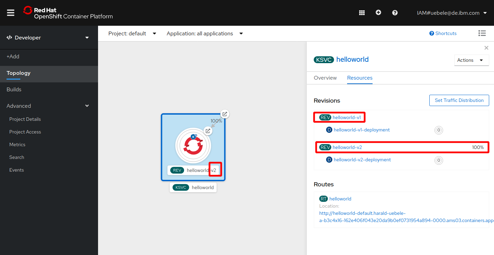

# Knative Revisions

A Knative Revision is a specific version of a code deployment. 

If you deploy a new version of an app in Kubernetes, you typically change the deployment.yaml file and apply the changed version using `kubectl`. Kubernetes will then perform a rolling update from the old to the new version.

If you have used Istio before, you know that with Istio you can deploy multiple versions of your application. 

With Knative, every deployment of a new version will create a new revision. If you explicitly name the revisions, you will have to change the name with every new deployment, otherwise Knative will decline the deployment.

This is version 2 of the helloworld app, specified in *service-v2.yaml*:
```
apiVersion: serving.knative.dev/v1
kind: Service
metadata:
  name: helloworld
spec:
  template:
    metadata:
      name: helloworld-v2
    spec:
      containers:
        - image: docker.io/ibmcom/kn-helloworld
          env:
            - name: TARGET
              value: "HelloWorld Sample v2 -- UPDATED"
```

Version 2 has a new value for the TARGET environment variable. 
It also has a new revision name ('helloworld-v2'), if this does not change, Knative will deny the request.

1. In the IBM Cloud Shell, apply the new version:
   ```
   oc apply -f service-v2.yaml
   ```
1. Check the Knative Service:
   ```
   kn service describe helloworld
   ```
   Output:
   ```
   Name:       helloworld
   Namespace:  default
   Age:        53s
   URL:        http://helloworld....appdomain.cloud

   Revisions:  
     100%  @latest (helloworld-v2) [2] (44s)
           Image:  docker.io/ibmcom/kn-helloworld (at b17fc9)
  
   Conditions:  
     OK TYPE                   AGE REASON
     ++ Ready                  40s 
     ++ ConfigurationsReady    40s 
     ++ RoutesReady            40s 
   ```
   You can see that the '@latest' revison is 'helloworld-v2'.
   
1. Back in the OpenShift Web Console, Topology view:
   
   It hasn't changed a lot, but notice the revision v2 in the KSVC box, and in the 'Resources' view you now see both revisions, but revision v2 has 100%. Its the same 100% we could see in the previous step using `kn`.

1. Click on the Route, this will display the output of v2 ("Hello HelloWorld Sample v2 -- UPDATED!")
  Back in the Web Console, a pod will be started for Revision v2. It will scale to zero after a moment. 


---

__Continue with the next part [Knative Traffic Management](5-TrafficManagement.md)__