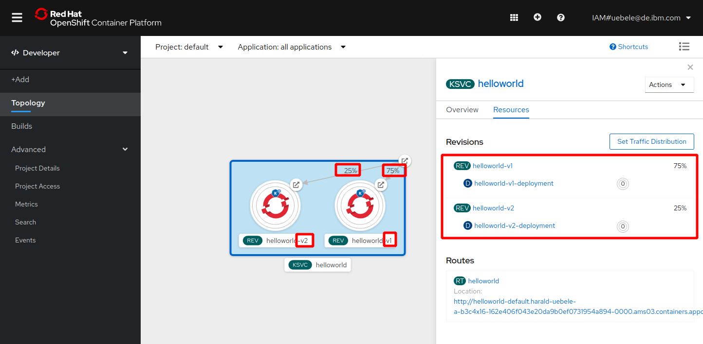

# Knative Traffic Management

In the last section you have replaced revision v1 of the helloworld app with revision v2.

What if you want to do a canary release and test the new revision/version on a subset of your users?  

This is something you can easily do with Istio. It requires additional VirtualService and DestinationRule definitions.

Here is the Knative way, *service-v2-canary.yaml*:
```
apiVersion: serving.knative.dev/v1
kind: Service
metadata:
  name: helloworld
spec:
  template:
    metadata:
      name: helloworld-v2
    spec:
      containers:
        - image: docker.io/ibmcom/kn-helloworld
          env:
            - name: TARGET
              value: "HelloWorld Sample v2 -- UPDATED"
  traffic:
    - tag: v1
      revisionName: helloworld-v1
      percent: 75
    - tag: v2
      revisionName: helloworld-v2
      percent: 25
```
Those additional 7 lines of code will create a 75% / 25% distribution between revisions -v1 / -v2.

1. In the IBM Cloud Shell session deploy the change:
   ```
   oc apply -f service-v2-canary.yaml
   ```
   
1. In the OpenShift Web Console, Topology, you can see that now both revisions are activated, v1 with 75 %, v2 with 25 %.
   

   With "Set Traffic Distribution" you can actually change the distribution without modifying and redeploying the YAML file.

1. Open the Route in your Browser and click refresh multiple times.

   You will see output of both revisions, v1 will show up more often than v2, though (75 % vs. 25 %).

   Back in the Topology view, you can see pods for both revisions are started.
   
---

__Continue with the next part [Knative Auto-Scaling](6-Scaling.md)__
